# Chat architecture and end-to-end flows

This document explains why each chat component exists, how state moves through
the system, and what happens during normal operation and failure recovery.

The central rule is:

> A model stream is temporary; the conversation and its run state are durable.

The HTTP connection, WebSocket, application node, Redis Pub/Sub subscription, or
OpenAI request may disappear. MySQL still contains enough information to reload
the UI and decide what work remains.

## System context

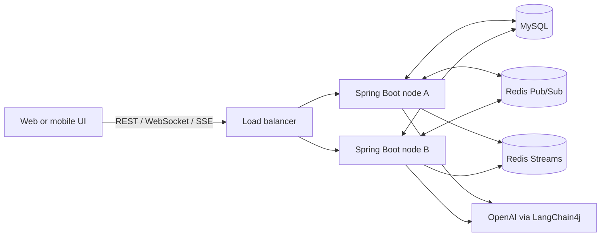

Redis has two separate roles. Streams retain recent events for replay. Pub/Sub
pushes new signals quickly but retains nothing. MySQL remains authoritative.

## Layer map

| Layer | Main classes | Responsibility |
|---|---|---|
| HTTP entry | `ChatResource`, `ConversationResource` | Validate REST input and return accepted/reload responses |
| WebSocket entry | `ChatWebSocketHandler`, `ChatWebSocketConfig` | Accept bidirectional commands and multiplex run subscriptions |
| SSE entry | `ChatRunSseService` | Replay and stream one run over server-sent events |
| Application service | `ChatService`, `ConversationService` | Coordinate use cases without transport-specific logic |
| Durable workflow | `ChatRunCoordinator`, `ChatRunRepository` | Enqueue, lease, execute, update, cancel, recover, and serialize runs |
| Model boundary | `LearningAssistant` | LangChain4j AI service and streaming `TokenStream` |
| Memory | `ChatMemoryConfig`, `JpaChatMemoryStore` | Provide bounded LangChain4j memory backed by MySQL |
| Reliable events | `ChatOutboxRepository`, `ChatOutboxPublisher` | Commit state and event intent atomically, then publish after commit |
| Replay | `RedisChatEventStore`, `InMemoryChatEventStore` | Append and replay events after a cursor |
| Fanout/signals | `RedisChatSignalBus`, `ChatLiveEventHub` | Cross-node wakeup/cancel/fanout and local subscriptions |
| Cross-cutting HTTP | `RequestLoggingFilter`, `ApiResponseFilter`, exception mappers | Trace requests, standardize responses, centralize errors |

## Durable data model

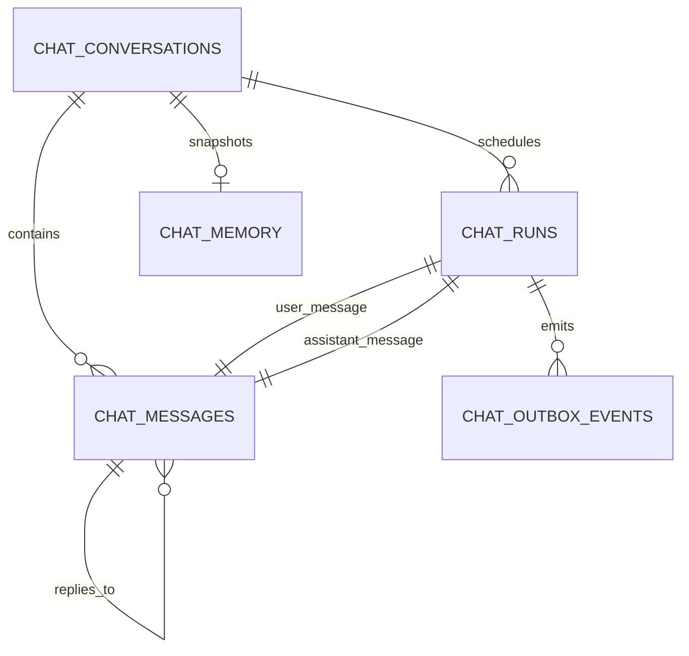

### `chat_conversations`

The aggregate root. It owns the next message sequence, optional title, timestamps,
and optimistic version. The repository locks this row while assigning message
sequence numbers and selecting work, which serializes conflicting decisions for
one conversation without globally locking all conversations.

### `chat_messages`

The reloadable transcript. Every turn creates two records immediately:

1. the user's message;
2. an empty assistant placeholder.

Both receive stable message IDs before model execution. The placeholder is
updated as streaming content arrives. `reply_to_id` gives the UI an explicit
relationship instead of requiring it to infer replies from array position.

### `chat_runs`

The durable workflow record connecting one user message and one assistant
message. It holds mode, status, cancellation intent, worker ownership, lease,
error code, and lifecycle timestamps.

### `chat_memory`

A serialized, bounded LangChain4j memory snapshot. It is a performance cache, not
the authoritative transcript. If absent or evicted, `JpaChatMemoryStore` rebuilds
memory from completed persisted messages.

### `chat_outbox_events`

The reliable database-to-event-bus bridge. Each state mutation persists an
outbox event in the same transaction. An event cannot be published for a rolled
back state, and a committed state cannot permanently lose its publication intent.

## State machines

### Run states

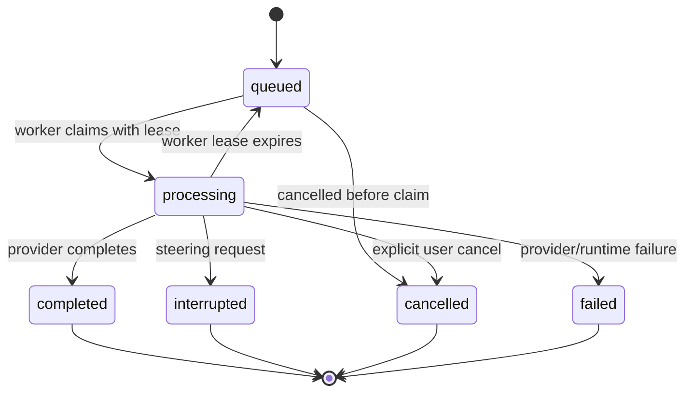

Terminal run states never return to processing. Recovery only changes an expired
`processing` run back to `queued`.

### Message states

```text
queued -> processing -> completed
                     -> interrupted
                     -> cancelled
                     -> failed
```

When steering interrupts a response, the original user message becomes completed
and the partial assistant message becomes interrupted. The new user message and
its assistant placeholder belong to a separate queued run.

## Flow 1: start a new conversation

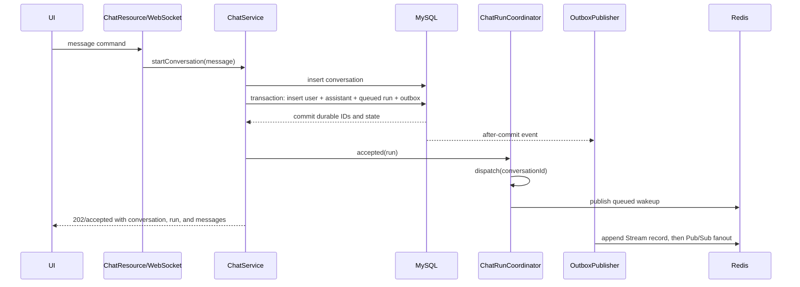

The response does not wait for OpenAI. `202 Accepted` means the command has been
durably accepted, not that generation has completed.

## Flow 2: claim and stream a run

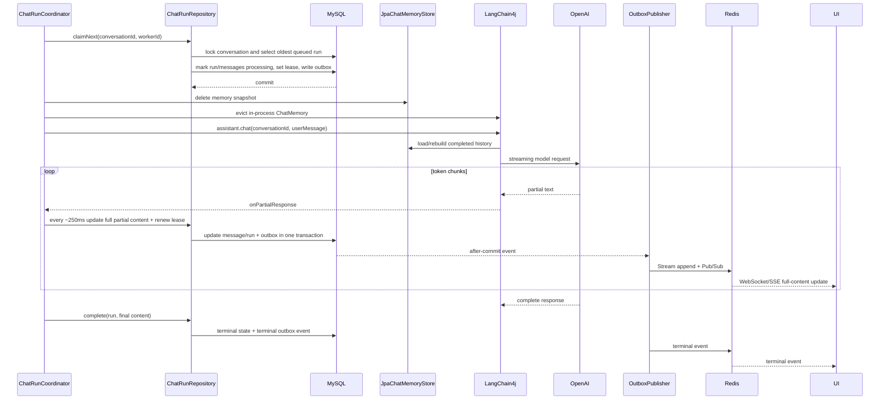

Partial events contain the complete accumulated assistant content. The client
replaces its displayed content instead of appending tokens. Duplicate delivery is
therefore harmless when combined with `eventId` deduplication.

## Flow 3: queue a subsequent message

With `mode=queue`, the new user and assistant records are persisted immediately,
but an already-processing run is left alone.

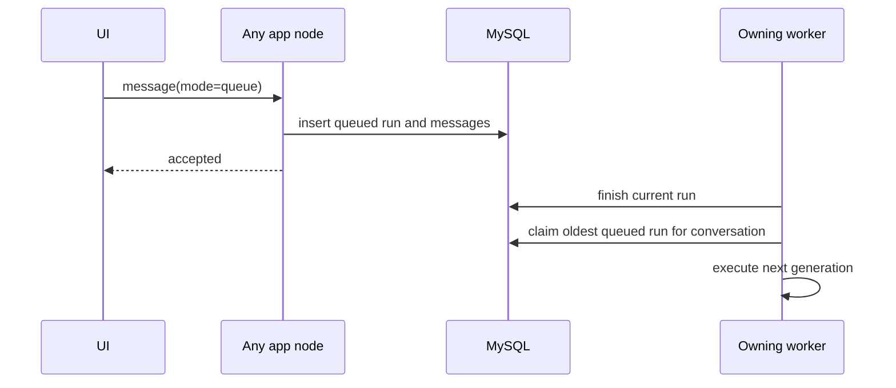

The conversation lock and oldest-created ordering preserve per-conversation run
order while other conversations execute concurrently.

## Flow 4: steer an active response

Steering is implemented as durable cancel-and-restart, not mutation of an
already-sent OpenAI prompt.

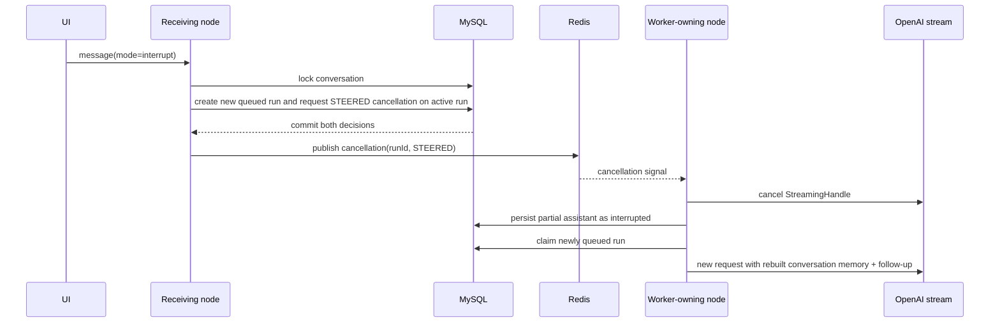

If Redis Pub/Sub misses the signal, the worker also checks the database
cancellation flag during partial flushes. Redis reduces latency; MySQL preserves
the decision.

LangChain4j memory is reset before the replacement run. `JpaChatMemoryStore`
rebuilds from persisted messages with `completed` status, and LangChain4j adds the
new current user message. Interrupted assistant output is not treated as a
completed model answer.

## Flow 5: explicit cancellation

The UI can cancel without sending another message through REST or WebSocket.

- A queued run transitions directly to `cancelled`; both messages become
  cancelled.
- A processing run records cancellation intent and signals the owning node.
- The worker cancels the LangChain4j `StreamingHandle`, persists available
  partial content, emits a terminal event, evicts memory, and checks for the next
  queued run.

Cancellation is best effort at the provider boundary. Tokens already generated
or already billed by the provider cannot be undone.

## Flow 6: transactional outbox delivery

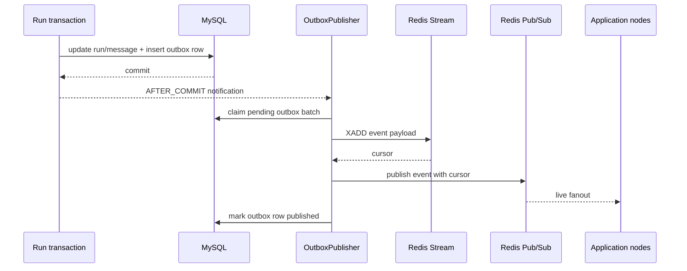

The after-commit notification gives low latency without querying MySQL every 100
milliseconds. `CHAT_OUTBOX_RECOVERY_INTERVAL` performs a slower safety scan for
events left behind by a crash.

Delivery is at least once. Consider this failure:

1. Redis Stream append succeeds.
2. The process crashes before `published_at` is committed.
3. Another publisher retries the outbox row.
4. Redis may contain the logical event twice.

The stable UUID `eventId` remains identical across retries, so clients can
deduplicate. Redis `cursor` identifies a physical Stream position and can differ
between duplicate records.

## Flow 7: WebSocket live delivery

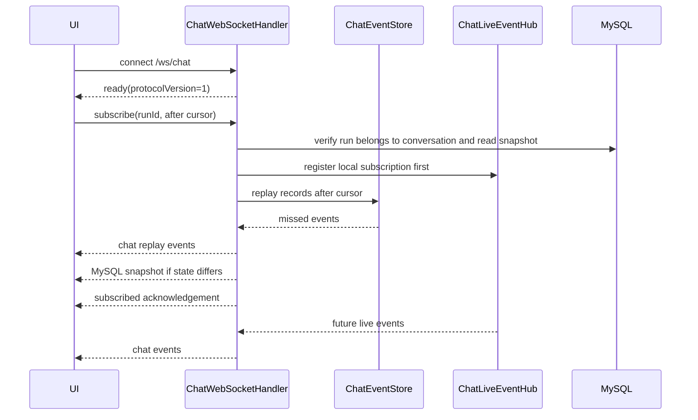

Registration happens before replay so an event arriving during replay is not
lost. Stable event IDs suppress duplicates introduced by that overlap.

Each physical session is wrapped in `ConcurrentWebSocketSessionDecorator` because
multiple model/outbox threads can attempt to send through one socket and Spring's
base WebSocket session does not allow concurrent writes.

## Flow 8: SSE reconnect

SSE is per run and server-to-client only.

1. Validate the conversation/run pair through MySQL.
2. Register with `ChatLiveEventHub`.
3. Replay Redis Stream records after `Last-Event-ID`.
4. Read MySQL again and emit a snapshot if it differs.
5. Send heartbeats while the run remains non-terminal.
6. Close after a terminal event.

The second database read closes the race between initial validation and live
subscription.

## Flow 9: browser reload

The browser must not attempt to reconstruct the full transcript exclusively from
WebSocket or Redis events.

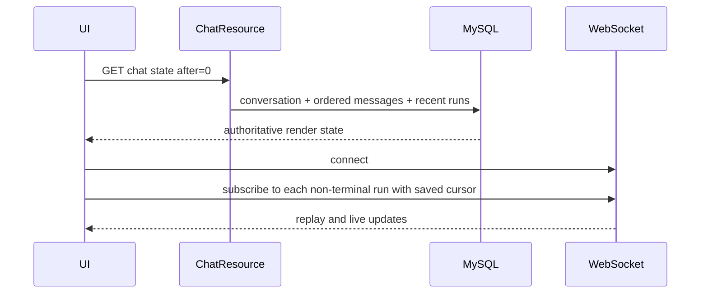

Pagination uses the conversation-local message `sequence`, not timestamps, so
equal timestamps cannot reorder messages.

## Flow 10: worker crash and lease recovery

Every processing run has `worker_id` and `lease_expires_at`. Partial flushes renew
the lease.

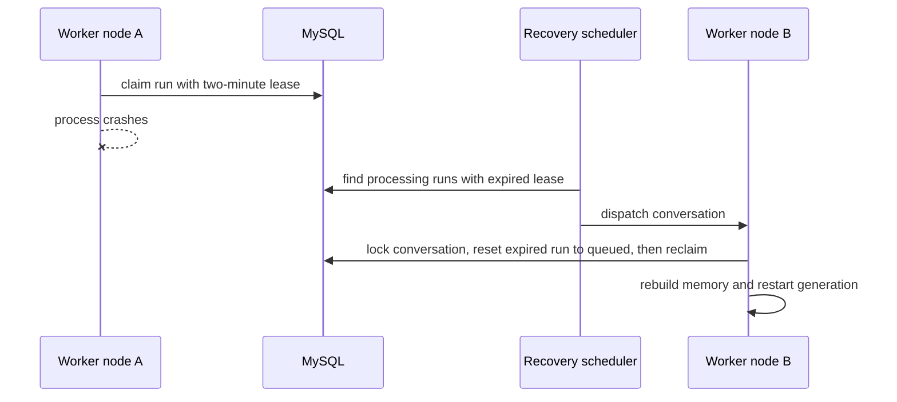

Restarting a generation may repeat provider work. The durable user-visible state
remains consistent, and full-content snapshots prevent duplicated text in the UI.

## Concurrency and ordering guarantees

- Different conversations can execute concurrently.
- At most one non-expired processing run is selected per conversation.
- Conversation pessimistic locks protect sequence allocation and claim decisions.
- `workerId` ownership prevents a stale worker from completing a run reclaimed by
  another node.
- Entity versions provide optimistic protection on mutable aggregates.
- `Idempotency-Key` prevents duplicate user turns caused by HTTP/UI retry.
- `eventId` prevents duplicate UI processing caused by at-least-once delivery.
- `cursor` orders/replays physical Redis Stream records.
- `requestId` correlates an HTTP request or WebSocket command with logs and its
  acknowledgement.

These IDs solve different problems and should not be substituted for one another.

## Failure matrix

| Failure | Result | Recovery |
|---|---|---|
| Browser disconnect | Generation continues | Reload MySQL state and resume after cursor |
| Pub/Sub event missed | Live update is temporarily absent | Redis Stream replay or MySQL reconciliation |
| Redis unavailable | Outbox row remains unpublished | Outbox recovery scan retries after Redis returns |
| App crashes before DB commit | No accepted durable work | Client retries with same idempotency key |
| App crashes after DB commit | Run/outbox remain durable | Another node dispatches/publishes |
| Worker dies during generation | Lease eventually expires | Recovery scan reclaims run |
| Provider fails | Run/message become failed with error code | UI can display retry action |
| Duplicate outbox publication | Same event may appear more than once | Client deduplicates stable `eventId` |
| SSE/WebSocket race during reconnect | Replay and live event may overlap | Server and client deduplicate event ID |

## Why WebSocket and SSE both exist

WebSocket is the preferred interactive transport because the same connection can
carry new messages, cancellation, steering, subscriptions, and live events. SSE
is useful for simpler clients, infrastructure that handles HTTP streaming more
reliably, or debugging with standard HTTP tools.

Neither transport owns state. Both can be replaced without changing the durable
run model.

## What is and is not claimed

This combines common production patterns: durable workflow records, leases,
transactional outbox, bounded replay, ephemeral fanout, idempotency, and
resumable transports. It is not a claim about private ChatGPT internals.

The current `interrupt` implementation cancels the LangChain4j stream and creates
a new provider request. Provider-native mid-response steering is a separate
capability and should live behind a provider adapter if adopted later.

For deployment settings and production boundaries, continue with
[OPERATIONS.md](OPERATIONS.md). For exact client payloads, see
[CHAT_PROTOCOL.md](CHAT_PROTOCOL.md).
